# Siamese Fruits Detector

Computer Vision project to detect different varieties of fruits and vegetables included: Apple, Banana, Eggplant, Lychee, Mango, Onion, Orange, Pear, Potato etc using [Siamese Network](https://www.cs.cmu.edu/~rsalakhu/papers/oneshot1.pdf), one of powerful one-shot-learning techniques currently getting increasingly popular in Deep Learning research and applications.

## Datasets

Datasets was obtained and carefully filtered from [Kaggle Fruit 360](https://www.kaggle.com/moltean/fruits) consisting of 82213 RGB images of 120 fruits and vegetables.

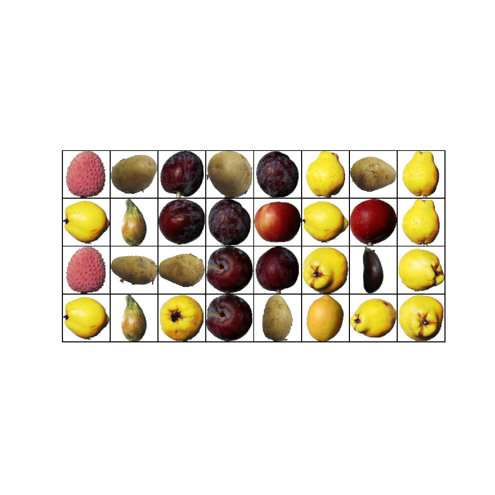

## Train Images

I turned the training images into Luminance-based (not RGB) images in order to avoid the network cheating the colour of fruits or vegetables when predicting the dissimilarity score of two input images.

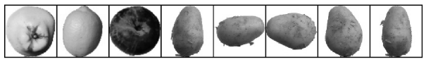

## Deep Learning Framework

To research and implement the technique, I was supported by two popular open-source Deep Learning framework, namely: [Pytorch](https://pytorch.org/) and [ReNom](https://renom.jp).

## Learning Process

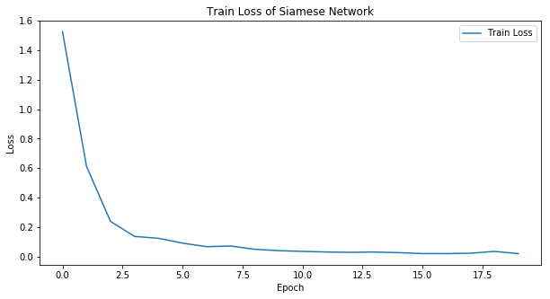

## Work Results

As shown from the following results, the network can successfully differentiated all testing images. When the pair of two simillar images but categorized in the same class were fed into the network, it can predicted its dissimilarity in lowest score.

> Note that, these testing images were never seen by the network during training process!

#### Pepper Yellow

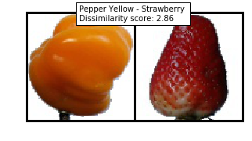
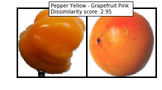
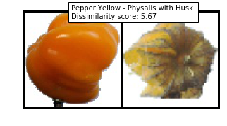
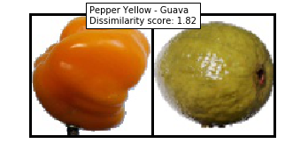
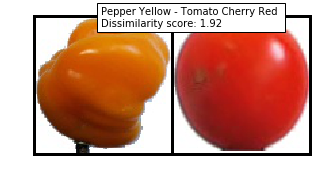

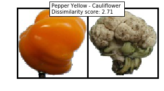
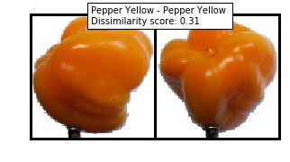

#### Tomato Cherry Red

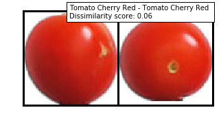
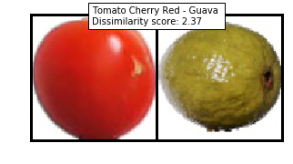

#### Grapefruit Pink

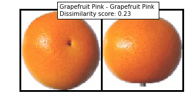
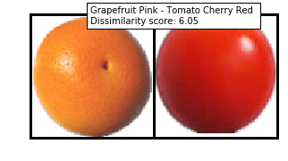

#### Physalis with Husk

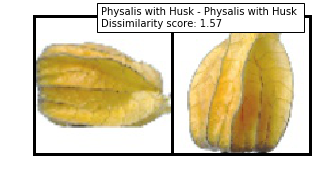
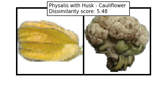

## Lesson Learned
According to the research I conducted, I found that there are 3 crucial points to notice when building Siamese network:

1. Datasets we obtain to train the network must be balanced with as many positive as negative samples since we want the network to learn well similarity function, otherwise learning process doesn’t meet desired result

2. The layers in the two subnetwork must share the same weights each other. This allows the network to learn symmetrically when capturing meaningful features for a pair of input image

3. Calculating the squared distances of the feature vectors. To measure the performance of the network, we can experience with three popular distance metrics proposed by research including binary-cross entropy, contrastive and triplet loss. For my case, I used contrastive loss to lead learning process into good result

## Dependencies

This project requires **Python 3.6** and the following Python libraries installed:

* [NumPy](https://www.numpy.org/)
* [PIL 1.1.7](https://pillow.readthedocs.io/)
* [matplotlib](https://matplotlib.org/)
